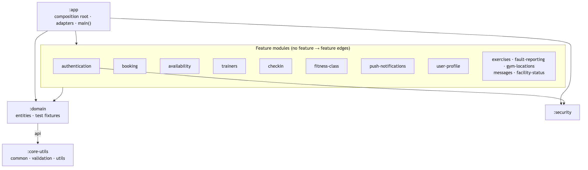
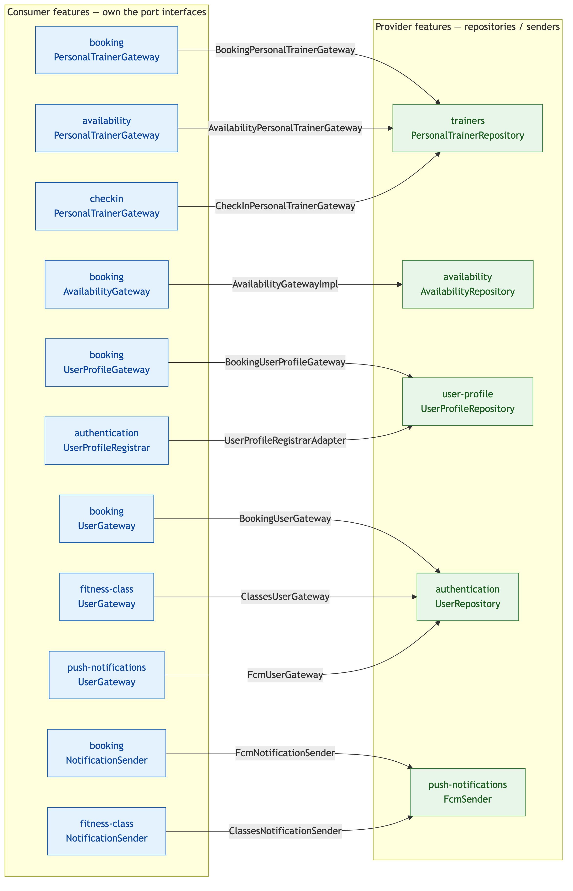

# Gym Planner playground project

A playground project to experiment with Spring Boot using REST and WebSockets. This project leverages reactive programming and modern Kotlin features to create an efficient and scalable backend.

This service provides a scalable and reactive backend for managing gym operations, including personal training bookings, fitness class management, and reporting faulty gym equipment.

## Technologies Used

- **Spring Boot WebFlux** - For building reactive REST APIs and WebSockets
- **MongoDB** - NoSQL database for data persistence
- **Kotlin** - Concise, expressive, and modern JVM language
- **Coroutines** - Asynchronous programming with structured concurrency
- **MockK** - Kotlin-first mocking library for unit testing
- **Flapdoodle Embedded MongoDB** - Lightweight in-memory MongoDB for testing
- **JSON Web Token (JWT)** - Secure authentication and authorization

## Features

- Reactive API using WebFlux
- WebSocket support for real-time communication
- Asynchronous data processing with coroutines
- JWT-based authentication
- Embedded MongoDB for easier testing

## Architecture

The service is a multi-module Spring Boot app built as a **hexagonal (ports & adapters)** system. Each feature is a self-contained vertical slice that depends only on the shared base modules (`:domain`, `:core-utils`) — **never on another feature**. When one feature needs something another owns, it declares a **port** (an interface it owns) and consumes that; the concrete **adapters** that satisfy every port live in `:app`, the single composition root that depends on every feature and wires them together at runtime via Spring component scanning.

### Module layering

`:app` → feature modules → `:domain` → `:core-utils`. No feature depends on another feature.



### Ports & adapters flow

Each edge is one dependency inversion: a consumer's **port** (left, blue) is implemented by an **adapter in `:app`** (edge label) that delegates to a **provider's bean** (right, green).



See [docs/architecture.md](docs/architecture.md) for the editable Mermaid sources and a fuller explanation.

## Getting Started

### Prerequisites

Ensure you have the following installed:

- JDK 17+
- Docker (optional, for running MongoDB)
- Gradle or Maven

### Running the Application

1. Clone the repository:
   ```sh
   git clone git@github.com:IanArb/GymPlannerService.git
   ```
2. Start MongoDB (if not using embedded MongoDB):
   ```sh
   docker run -d --name mongodb -p 27017:27017 mongo
   ```
3. Set the required environment variables (see [Environment Variables](#environment-variables) below), then run the application:
   ```sh
   export MONGO_URI="mongodb://localhost:27017"
   export MONGO_DATABASE_NAME="gymplanner"
   export ENVIRONMENT="dev"
   export JWT_EXPIRY="3600000"
   export JWT_SECRET_KEY="a-long-random-secret"
   ./gradlew bootRun
   ```

### Environment Variables

`./gradlew bootRun` requires the following environment variables at runtime. They are **not** needed for tests, which use an embedded Flapdoodle MongoDB.

| Variable | Purpose | Example |
|---|---|---|
| `MONGO_URI` | MongoDB connection string | `mongodb://localhost:27017` |
| `MONGO_DATABASE_NAME` | MongoDB database name | `gymplanner` |
| `ENVIRONMENT` | Active Spring profile (`dev`, `staging`, `production`) | `dev` |
| `JWT_EXPIRY` | JWT expiration in milliseconds | `3600000` |
| `JWT_SECRET_KEY` | JWT signing secret | `a-long-random-secret` |

### Running Tests

Run tests using:
```sh
./gradlew test
```

### OpenAPI Endpoints

This project automatically generates OpenAPI 3.0 documentation using Springdoc OpenAPI.

Swagger UI: http://localhost:8080/webjars/swagger-ui/index.html

Swagger UI provides an interactive interface to view and test your API endpoints.

OpenAPI JSON Spec: http://localhost:8080/v3/api-docs

This endpoint serves the raw OpenAPI documentation in JSON format.

These endpoints are available once the application is running. You can explore the API, try requests directly from Swagger UI, and see the API documentation in real-time.

## Contributing

Feel free to fork and submit pull requests to improve this project!

## License

This project is licensed under the MIT License.

