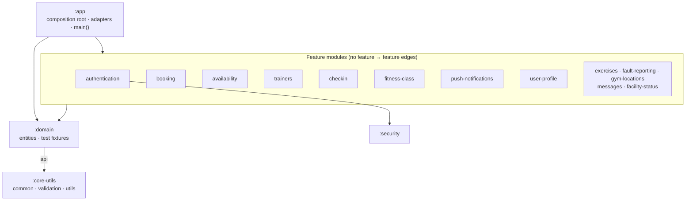
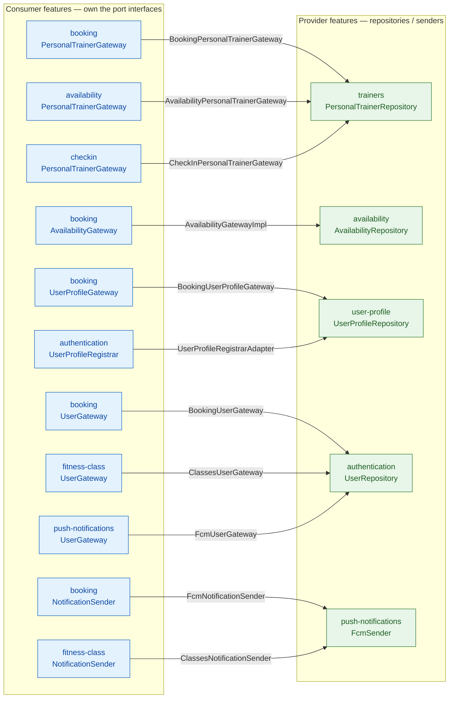

# Architecture — Ports & Adapters

GymPlannerService is a multi-module Spring Boot app arranged as a **hexagonal
(ports-and-adapters)** system. Every feature is a vertical slice that depends only on
the shared base modules (`:domain`, `:core-utils`) — **never on another feature**. When
a feature needs something another feature owns, it declares a **port** (an interface it
owns) and consumes that. The concrete **adapters** that satisfy those ports all live in
`:app`, the single composition root that depends on every feature and wires them
together at runtime via Spring component scanning.

## Module layering

`:app` depends on every feature module plus `:domain`; `:security` is not a direct
`:app` dependency — it is pulled in transitively through `:authentication`, which is
the only module that uses it.

## Ports & adapters flow

Each edge is one dependency inversion: a **consumer's port** (left) is implemented by an
**adapter in `:app`** (edge label) that delegates to a **provider's bean** (right).

> All 11 adapters (the edge labels) are `@Component`s under
> `app/.../gateway/`. Because every feature shares the `com.ianarbuckle.gymplannerservice`
> base package, Spring's component scan from `:app` discovers ports (in features) and
> adapters (in `:app`) and injects the adapter wherever a feature's service asks for its
> port.

## Why this shape

- **No feature → feature dependency.** A feature compiles and tests in isolation with
  only `:domain`/`:core-utils` on its classpath.
- **Consumer owns the port.** The interface expresses exactly what the consumer needs
  (interface segregation), e.g. `booking.UserGateway.findPushNotificationToken(userId)`
  vs `fitness-class.UserGateway.findAllPushNotificationTokens()`.
- **`:app` is the only place that knows every feature.** Swapping a provider (e.g. a new
  APNS notifier) is an adapter change in `:app`, invisible to the consumer.